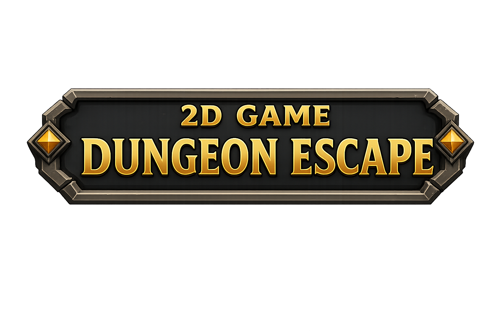

# Dungeon Escape Project

Repository description: a Unity 6 / URP 2D dungeon escape game with player movement, dash and charge combat, enemies, a FinalBoss, collectibles, key-gated progression, interactables, hazards, scene transitions, persistent audio, HUD feedback, and an Architect-maintained project wiki.

## GitHub About

Short description:

```text
Unity 6 / URP 2D dungeon escape game with combat, collectibles, hazards, progression, scene transitions, persistent audio, HUD feedback, and a living architecture wiki.
```

Suggested topics:

```text
unity unity-6 urp 2d-game dungeon-game csharp game-development pixel-art ugui textmeshpro
```

## Project Snapshot

| Item | Value |
|:-----|:------|
| Engine | Unity `6000.3.7f1` |
| Render pipeline | Universal Render Pipeline `17.3.0` |
| Project type | 2D dungeon action/adventure |
| Main branch | `main` |
| GitHub repository | `MakeItEzzz555/Dungeon_Escape_Project` |
| Main scenes | `Main Menu`, `Level 1`, `Level 2`, `Level 3` |
| UI stack | UGUI, TextMesh Pro, `InputSystemUIInputModule` |
| Gameplay input | Legacy `UnityEngine.Input` calls with both legacy and new input paths enabled |
| Architecture memory | `CONTEXT.md` and `The-Unity-Architect/Wiki/` |

## Game Overview

Dungeon Escape is a top-down 2D dungeon project built around room traversal, combat, collection, and level completion. The player moves through authored dungeon scenes, fights enemies, collects coins and keys, opens chests, uses levers, avoids traps and fall zones, and completes levels through checkpoint doors.

The current architecture is documented through The Unity Architect wiki. The README is intentionally the repository landing page; detailed behavior, tradeoffs, and implementation contracts live in the linked wiki documents.

## Player Experience

- Start from `Main Menu`, adjust audio settings, and enter gameplay.
- Move, idle, attack, dash with `PlayerDash`, and unlock `PlayerChargeAttack` through `SwordConsumable`.
- Fight shared `Health` / `Hitbox` / `HurtBox` combatants, including regular enemies and `FinalBoss`.
- Collect coins, keys, `HPConsumable` pickups, and authored death rewards.
- Use `Lever_On`, `LeverResponder`, `InteractiveGate`, doors, and chests to progress through authored spaces.
- Avoid `SpikeTrapFSM` traps and `FallZone` hazards with directional fall feedback.
- Complete levels through `CheckpointDoor` and view `RunResultsPanel` summaries.
- Experience consistent zoom/fade scene transitions and respawn transitions through `SceneTransitionManager`.

## Controls

| Action | Input |
|:-------|:------|
| Move | Legacy gameplay movement axes |
| Interact | `E` |
| Attack | Existing player attack binding in `PlayerCombat` |
| Dash | Left Shift |
| Charge attack | `Q`, after collecting `SwordConsumable` |
| Pause | Pause menu binding handled by the UI/menu scripts |

## Core Runtime Systems

| System | Responsibility | Wiki |
|:-------|:---------------|:-----|
| Bootstrap and Persistence | Loads `PersistentSystems`, global services, fallback camera infrastructure, and scene EventSystem support. | [`BootstrapAndPersistence.md`](The-Unity-Architect/Wiki/Systems/BootstrapAndPersistence.md) |
| Audio | Owns music, SFX, saved volume state, and scene music enforcement through `AudioManager`. | [`Audio.md`](The-Unity-Architect/Wiki/Systems/Audio.md) |
| Input | Documents gameplay input call sites and UI input infrastructure. | [`Input.md`](The-Unity-Architect/Wiki/Systems/Input.md) |
| UI and HUD | Owns main menu, pause menu, HUD counters, HP images, boss HP, messages, settings, and run results. | [`UIAndHUD.md`](The-Unity-Architect/Wiki/Systems/UIAndHUD.md) |
| Player | Owns movement, state locks, animation bridge, dash, charge attack, death, fall, and `HurtBox` provisioning. | [`Player.md`](The-Unity-Architect/Wiki/Systems/Player.md) |
| Combat | Shared `Health`, `Hitbox`, `HurtBox`, player combat, enemy combat, and FinalBoss combat rules. | [`Combat.md`](The-Unity-Architect/Wiki/Systems/Combat.md) |
| Enemy AI | Enemy idle, chase, attack, return-home, death, range detection, and animation/combat bridge behavior. | [`EnemyAI.md`](The-Unity-Architect/Wiki/Systems/EnemyAI.md) |
| Progression | Key quest state, checkpoint completion, run timing, and completion results flow. | [`Progression.md`](The-Unity-Architect/Wiki/Systems/Progression.md) |
| Collectibles | Coins, keys, health pickups, HUD integration, and pickup feedback. | [`Collectibles.md`](The-Unity-Architect/Wiki/Systems/Collectibles.md) |
| Interactables | Levers, gates, doors, chests, and bool signal adapters. | [`Interactables.md`](The-Unity-Architect/Wiki/Systems/Interactables.md) |
| Traps and Hazards | Spike/rolling trap state, trap damage windows, fall zones, and directional fall nudges. | [`TrapsAndHazards.md`](The-Unity-Architect/Wiki/Systems/TrapsAndHazards.md) |
| Scene Transitions | Zoom, fade, scene loading, respawn, run results exit, pause exit, and main menu play flows. | [`SceneTransitions.md`](The-Unity-Architect/Wiki/Systems/SceneTransitions.md) |
| Camera | Player follow, transition zoom, pause coupling, and audio listener cleanup. | [`Camera.md`](The-Unity-Architect/Wiki/Systems/Camera.md) |
| Environment and Presentation | `YSort`, light rays, torches, waterfalls, animated props, tilemaps, and environment grouping. | [`EnvironmentAndPresentation.md`](The-Unity-Architect/Wiki/Systems/EnvironmentAndPresentation.md) |
| Animation Assets | Inventory of animation clips, controllers, and animated tiles. | [`AnimationAssets.md`](The-Unity-Architect/Wiki/Systems/AnimationAssets.md) |
| Scenes and Prefabs | Scene, prefab, resource, and script reference inventory. | [`ScenesAndPrefabs.md`](The-Unity-Architect/Wiki/Systems/ScenesAndPrefabs.md) |

## Feature Catalog

| Feature | Summary | Design doc |
|:--------|:--------|:-----------|
| Persistent Runtime Bootstrap | Keeps persistent runtime systems available across scene loads. | [`PersistentRuntimeBootstrap.md`](The-Unity-Architect/Wiki/Features/PersistentRuntimeBootstrap.md) |
| Main Menu and Pause Menu | Lets players start, pause, resume, configure settings, and quit. | [`MainMenuAndPauseMenu.md`](The-Unity-Architect/Wiki/Features/MainMenuAndPauseMenu.md) |
| Audio Volume Settings | Lets players edit music and SFX volume while `AudioManager` remains the source of truth. | [`AudioVolumeSettings.md`](The-Unity-Architect/Wiki/Features/AudioVolumeSettings.md) |
| Player Movement and State | Handles dungeon movement, idle, falling, death, and respawn ownership. | [`PlayerMovementAndState.md`](The-Unity-Architect/Wiki/Features/PlayerMovementAndState.md) |
| Player Dash | Adds a Left Shift burst movement ability with cooldown. | [`PlayerDash.md`](The-Unity-Architect/Wiki/Features/PlayerDash.md) |
| Player Combat | Opens sword hitbox windows through animation events and plays attack feedback. | [`PlayerCombat.md`](The-Unity-Architect/Wiki/Features/PlayerCombat.md) |
| Sword Consumable and Player Charge Attack | Unlocks `PlayerChargeAttack` for the current run through `SwordConsumable`. | [`SwordConsumableAndPlayerChargeAttack.md`](The-Unity-Architect/Wiki/Features/SwordConsumableAndPlayerChargeAttack.md) |
| Enemy Encounters | Provides enemy idle, chase, attack, return-home, and death behavior. | [`EnemyEncounters.md`](The-Unity-Architect/Wiki/Features/EnemyEncounters.md) |
| FinalBoss | Adds a boss enemy with phases, attack selection, and high-damage charge behavior. | [`FinalBoss.md`](The-Unity-Architect/Wiki/Features/FinalBoss.md) |
| Enemy Death Rewards | Reveals authored reward objects, such as chests, when enemies or FinalBoss die. | [`EnemyDeathRewards.md`](The-Unity-Architect/Wiki/Features/EnemyDeathRewards.md) |
| Key Quest and Level Exit | Requires key progress before `CheckpointDoor` can complete a level. | [`KeyQuestAndLevelExit.md`](The-Unity-Architect/Wiki/Features/KeyQuestAndLevelExit.md) |
| Coin and Key Collection | Updates HUD progress and feedback when coins and keys are collected. | [`CoinAndKeyCollection.md`](The-Unity-Architect/Wiki/Features/CoinAndKeyCollection.md) |
| HP Consumable | Restores player HP in Level 3 through the shared health system. | [`HPConsumable.md`](The-Unity-Architect/Wiki/Features/HPConsumable.md) |
| HUD and Feedback | Shows HP, coin/key progress, boss HP, and short interaction messages. | [`HUDAndFeedback.md`](The-Unity-Architect/Wiki/Features/HUDAndFeedback.md) |
| Player HP HUD | Represents player HP through image slots and updates from `Health`. | [`PlayerHPHUD.md`](The-Unity-Architect/Wiki/Features/PlayerHPHUD.md) |
| Run Results Panel | Shows end-of-attempt completion or failure results. | [`RunResultsPanel.md`](The-Unity-Architect/Wiki/Features/RunResultsPanel.md) |
| Lever and Gate Interaction | Lets players press `E` near levers to control gates or trap targets. | [`LeverAndGateInteraction.md`](The-Unity-Architect/Wiki/Features/LeverAndGateInteraction.md) |
| Chest Interaction | Opens chests and optionally reveals assigned contents. | [`ChestInteraction.md`](The-Unity-Architect/Wiki/Features/ChestInteraction.md) |
| Traps and Fall Hazards | Adds traps and fall zones that damage, kill, or reset the player. | [`TrapsAndFallHazards.md`](The-Unity-Architect/Wiki/Features/TrapsAndFallHazards.md) |
| FallZone Directional Nudge | Glides the player briefly into a fall hazard before the fall sequence takes over. | [`FallZoneDirectionalNudge.md`](The-Unity-Architect/Wiki/Features/FallZoneDirectionalNudge.md) |
| Respawn Transition | Uses the same zoom/fade language as level transitions for death and fall recovery. | [`RespawnTransition.md`](The-Unity-Architect/Wiki/Features/RespawnTransition.md) |
| Scene Transition Experience | Handles level completion zoom/fade transitions and control restoration. | [`SceneTransitionExperience.md`](The-Unity-Architect/Wiki/Features/SceneTransitionExperience.md) |
| Camera Follow and Zoom | Follows the player during gameplay and zooms during transitions. | [`CameraFollowAndZoom.md`](The-Unity-Architect/Wiki/Features/CameraFollowAndZoom.md) |
| Environment Presentation | Presents layered dungeons with sorting, animated props, lights, torches, and waterfalls. | [`EnvironmentPresentation.md`](The-Unity-Architect/Wiki/Features/EnvironmentPresentation.md) |

## Repository Layout

| Path | Purpose |
|:-----|:--------|
| `Assets/Scenes/` | Unity scenes, including `Main Menu`, `Level 1`, `Level 2`, and `Level 3`. |
| `Assets/Scripts/` | Runtime C# scripts grouped by gameplay area. |
| `Assets/Prefabs/` | Player, managers, collectibles, enemies, interactables, traps, camera, and environment prefabs. |
| `Assets/Resources/PersistentSystems.prefab` | Persistent runtime services prefab loaded by `GameBootstrapper`. |
| `Assets/Animations/` | Animation clips, controllers, animated tiles, and presentation assets. |
| `Assets/Audio/`, `Assets/Dungeon_Music/`, `Assets/Music_mm/` | Music and SFX assets used by `AudioManager` and gameplay feedback. |
| `Packages/manifest.json` | Unity package dependencies. |
| `ProjectSettings/` | Unity project settings and render pipeline configuration. |
| `CONTEXT.md` | Canonical ubiquitous language glossary. |
| `The-Unity-Architect/Wiki/` | Project memory: systems, features, ADRs, logs, and audit notes. |
| `The-Unity-Architect/execution/` | Architecture audit, project graph, and editor log analysis tools. |

## Architecture Rules

The canonical project language is defined in [`CONTEXT.md`](CONTEXT.md). Code, Inspector labels, wiki pages, and future feature documents should use those names consistently.

Important current boundaries:

- `AudioManager` owns audio playback, volume state, and persistence.
- `AudioSettingsUI` is a UI binder only.
- `GlobalQuestManager` owns key progress and quest completion state.
- `CheckpointDoor` owns level-completion interaction and delegates transition sequencing.
- `SceneTransitionManager` orchestrates transitions while camera zoom and UI fade are delegated to dedicated systems.
- `HUDManager` owns HUD counters, HP displays, boss HP, messages, and run results presentation.
- `Health`, `Hitbox`, and `HurtBox` are the shared combat core.
- Simulation and presentation should stay decoupled when adding new systems.

## Setup

1. Install Unity `6000.3.7f1` through Unity Hub.
2. Clone the repository.
3. Open the repository root as the Unity project.
4. Let Unity restore packages from `Packages/manifest.json`.
5. Open `Assets/Scenes/Main Menu.unity` to start from the menu flow, or open a level scene directly for gameplay testing.

The `.gitignore` is configured for a Unity project and excludes generated folders such as `Library/`, `Temp/`, `Obj/`, `Build/`, `Builds/`, `Logs/`, and `UserSettings/`.

## Validation and Audit Tools

The Architect tooling lives in `The-Unity-Architect/execution/`:

```sh
node The-Unity-Architect/execution/unity-doctor.js
node The-Unity-Architect/execution/unity-project-graph.js
python The-Unity-Architect/execution/parse_editor_log.py
```

Current local audit notes:

- `parse_editor_log.py` runs successfully.
- `unity-doctor.js` and `unity-project-graph.js` require `node`; the current shell did not have `node` installed or on `PATH` during this README update.
- The latest parsed editor log noise was mainly Unity AI Assistant API deprecation messages, fallback shader compile entries, and a Cloud Diagnostics symbol upload path warning, not a gameplay script compile failure.

## Known Architecture Debt

Tracked in [`SystemMap.md`](The-Unity-Architect/Wiki/Systems/SystemMap.md):

- Gameplay input uses legacy `Input` while UGUI uses the new Input System module.
- `PlayerController` owns several responsibilities: movement, input, idle state, footstep audio, fall/death flow, scene reload, and `HurtBox` provisioning.
- Some gameplay objects call `HUDManager` and `AudioManager` directly.
- `Health` currently drives animator parameters directly.
- Some runtime logging should be gated before production.
- `HurtBox` ownership is split between prefab setup and runtime creation by `PlayerController.EnsureHurtBox()`.

## Working With The Wiki

Start here when changing the project:

- [`The-Unity-Architect/Wiki/Index.md`](The-Unity-Architect/Wiki/Index.md)
- [`The-Unity-Architect/Wiki/Systems/SystemMap.md`](The-Unity-Architect/Wiki/Systems/SystemMap.md)
- [`The-Unity-Architect/Wiki/Features/FeatureIndex.md`](The-Unity-Architect/Wiki/Features/FeatureIndex.md)
- [`CONTEXT.md`](CONTEXT.md)

When adding a new feature, follow the Unity Architect pipeline: define terms in `CONTEXT.md`, write the GDD, archive the feature document in `The-Unity-Architect/Wiki/Features/`, and log technical tradeoffs in `The-Unity-Architect/Wiki/ADR/`.
